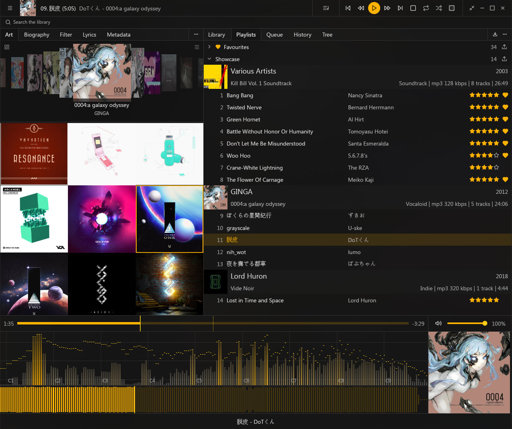
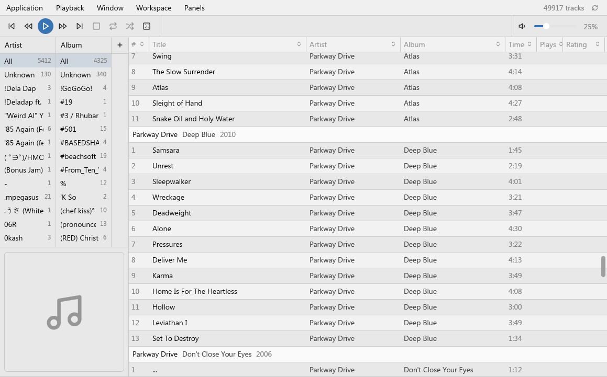
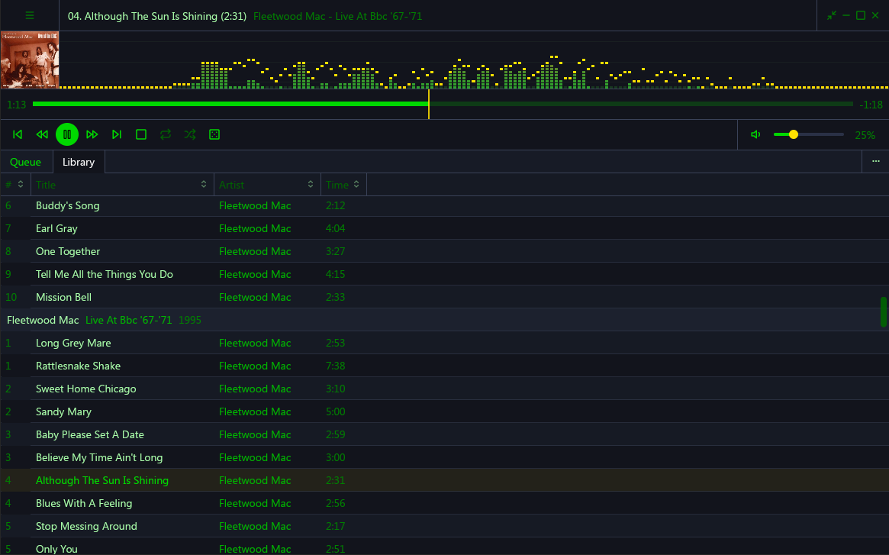
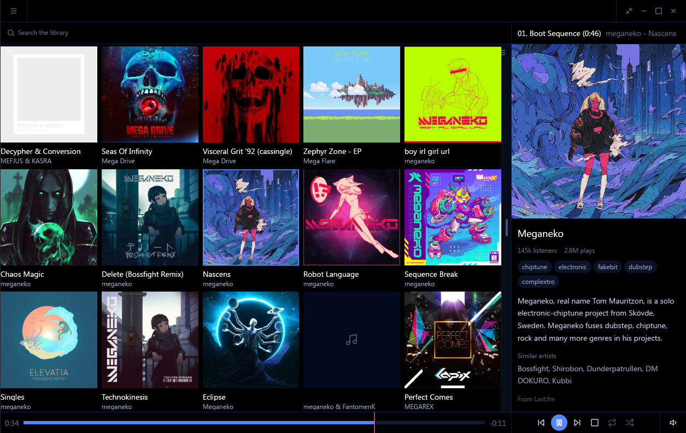
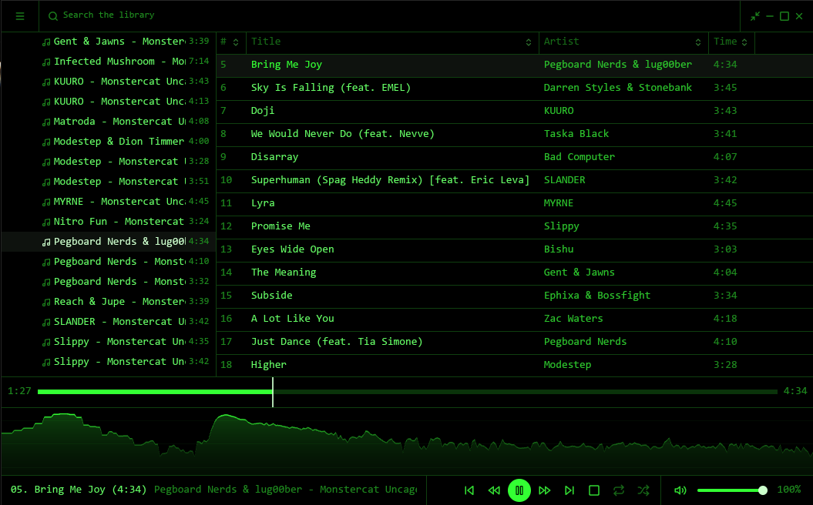

<p align="center">
  
</p>

<h1 align="center">rox</h1>

<p align="center"><em>If Foobar2000 was made in the current year.</em></p>

rox is a desktop music player for people with large, carefully tagged local libraries.
The UI is panels you compose yourself, duplicate with independent configs, and pop out
into real OS windows. Themes are token sets a person can share. Tagging is deep enough
to trust with a real collection, and the whole thing stays fast at tens of thousands of
tracks. Rust, built on gpui, with Linux, Mac, and Windows all first-class. If it doesn't
start in under a second, it isn't rox.



<details>
<summary><strong>The feature rundown</strong></summary>
<br>

| Area      | What's there                                                                                                                                                                                                        |
| --------- | ------------------------------------------------------------------------------------------------------------------------------------------------------------------------------------------------------------------- |
| Library   | Parallel scanner reading full tags and true durations, live folder watching that survives renames, files with unreadable tags indexed by filename so nothing silently drops, folder tree, filters, and search        |
| Playback  | Gapless single-stream engine, queue with shuffle, repeat, and play-next, recovery when an audio device disappears, media keys and now-playing integration on all three platforms                                      |
| Panels    | Two dozen panel types (library, queue, history, playlists, lyrics, tag editor, cover, biography, spectrum, waveform, VU), composed freely, duplicated with independent configs, popped out into OS windows            |
| Theming   | Workspaces as single shareable files (layout, palette, appearance), palette tinting from the playing album's cover per window, light and dark following cover brightness                                             |
| Tagging   | Full tag editor with atomic writes and batch edits, ratings stored in the files themselves (FMPS and POPM), online tag and cover lookup through MusicBrainz, iTunes, and Deezer, artist biographies                   |
| Lyrics    | Synced and plain lyrics from sidecar files, tags, or lrclib, with an in-panel editor that writes back where it read from                                                                                              |
| History   | A full listen log driving the history panel and stats window, Last.fm scrobbling                                                                                                                                     |
| Playlists | Favourites, drag reorder across playlists, m3u import and export, entries that survive their files leaving and returning                                                                                             |
| System    | Tray with quit-to-tray, portable mode, one binary                                                                                                                                                                    |

</details>

<details>
<summary><strong>Planned</strong></summary>
<br>

| Area              | What's coming                                                                                                                                            | Tracked                                                                                                                                                                                                                          |
| ----------------- | -------------------------------------------------------------------------------------------------------------------------------------------------------- | -------------------------------------------------------------------------------------------------------------------------------------------------------------------------------------------------------------------------------- |
| Audio chain       | A processing chain: an equalizer to prove it, crossfade, and an exclusive bit-perfect output mode                                                          | [#70](https://github.com/zealsprince/rox/issues/70), [#72](https://github.com/zealsprince/rox/issues/72), [#73](https://github.com/zealsprince/rox/issues/73), [#74](https://github.com/zealsprince/rox/issues/74)                 |
| Queue continuation | Endless play drawing from the library, history-aware weighted shuffle, and radio seeded by what's playing                                                 | [#34](https://github.com/zealsprince/rox/issues/34), [#37](https://github.com/zealsprince/rox/issues/37), [#38](https://github.com/zealsprince/rox/issues/38), [#39](https://github.com/zealsprince/rox/issues/39)                 |
| Auto-update       | Downloads and applies a release instead of pointing at it                                                                                                  | [#75](https://github.com/zealsprince/rox/issues/75)                                                                                                                                                                               |
| Sources           | Streaming services (Spotify, YouTube Music, Tidal) as community-maintained extensions, each its own library view, updating on their own release cycle when a service changes something | [#8](https://github.com/zealsprince/rox/issues/8)                                                                                                                                                                                 |
| Unified library   | One view merging local and streaming catalogs with matching across them, which is why track identity was never welded to file paths | [#9](https://github.com/zealsprince/rox/issues/9)                                                                                                                                                                                 |

The full picture, including what's out of scope, lives in the
[product docs](docs/01-product/01-vision.md).

</details>

## Benchmarks

All first-party numbers: the same machine (Ryzen 9 5950X, Linux/Wayland), the same
50k-track library on an external SSD, every player with the library loaded and
measured through one harness. Memory is PSS across the app's full process tree,
"loaded" is when CPU settles after launch, idle is a paused player with the window
visible.

| Player     | Window up | Fully loaded  | Memory  | Idle CPU |
| ---------- | --------- | ------------- | ------- | -------- |
| rox        | 0.3 s     | 2.3 s         | 134 MB  | 0.5%     |
| Elisa      | 0.7 s     | never settles | 206 MB  | 74%      |
| fooyin     | 0.3 s     | 18 s          | 364 MB  | 0%       |
| Quod Libet | -         | 19 s          | 384 MB  | 0.2%     |
| Strawberry | 0.3 s     | 32 s          | 434 MB  | 0.8%     |
| Museeks    | -         | 3 s           | 436 MB  | 0%       |
| Tauon      | 8.7 s     | 12 s          | 2.8 GB  | 0%       |

DeaDBeeF would sit at 44 MB, but it never got a row: its MP3 parser segfaults
partway through importing this library, every attempt. rox indexes all 50k
tracks, including the truncated files that trip it.

Scanning reads deep. rox pulls full tags and true durations from every file on
import, not a header skim, so the library you browse matches what's actually in
the files. The scanner is parallel and outruns storage: with file data cached, a
full import of this library lands in about 3 seconds; from a cold external SSD
it is around 3 minutes, the drive maxed out with CPU to spare. Like for like,
fooyin re-imports the same collection from a reset in about 30 seconds where rox
takes 3, and in every rox run the ceiling was the disk, never the player.

rox ships as one 62 MB binary. Tauon's Flatpak is a
[135 MB download](https://flathub.org/apps/com.github.taiko2k.tauonmb), the
Spotify client idles between 300 and 900 MB. Foobar2000 itself stays lean, but
you knew that, that's the point.

## Why

I loved Foobar2000 because of panel UI you build yourself, a theme community on top of it
(CaTRoX, NekoRoX, Georgia), and tag and library management that held up at scale. That
stack is stranded on Windows, and nothing on Linux or Mac covers all three legs: Tauon's
tagging is shallow, Strawberry isn't composable, Quod Libet isn't something you'd theme.

Oh right, and it needs to be native, everywhere.

I've been working on and off on variations of rox over the years through Golang and its
fragmented GUI ecosystem. I landed on Wails but work on it was sporadic and I still had
my Foobar setup. Progress took ages because making a GUI app on Go maybe isn't the best
or maybe I'm just bad at it, but as I progressed, I also noticed that I was just doing
another webapp which killed a lot of my motiviation to make a true spiritual successor
to Foobar2000 in my mind. It had to be fast, it had to be native, it had to look as
close as possible to CaTRoX.

Jump to the start of 2026 and I did a full-time move to Linux. Because of how CaTRoX
(and my NekoRoX fork) is built with tons of random work arounds, Internet Explorer
essentially running in panels and so on and so forth, it's just a pain to run through
Wine and it really surfaces just how hacky everything is put together. It feels like
the foundation isn't solid and everything is just one OS change away from exploding again.

I've been working on [Orbit](https://github.com/hivecom/orbit) on the side and wanted to
do an evaluation of [gpui](https://gpui.rs/) since I use [Zed](https://zed.dev/) and I
very much love the vision of going back native. I've been loving working with it for
prototypes and I realized I had most of the foundation written and all I had to do
is start mapping it over. So that's what I did. And now we have a new native player.

## Screenshots & Additional Workspaces

A workspace is a whole look in one shareable file: layout, palette, appearance.
The shot above is the Default workspace, and these ship in the box too, one
click away on the welcome window or in settings:

<table>
  <tr>
    <th width="50%">Foobar</th>
    <th width="50%">Llama (WinAmp)</th>
  </tr>
  <tr>
    <td></td>
    <td></td>
  </tr>
  <tr>
    <th>Metro</th>
    <th>Phosphor</th>
  </tr>
  <tr>
    <td valign="top"></td>
    <td valign="top"></td>
  </tr>
</table>


## Download

Grab your platform's build from the [releases page](https://github.com/zealsprince/rox/releases/latest).

- **Linux** 
  - **Arch Linux** - Available on the AUR as [`rox-player`](https://aur.archlinux.org/packages/rox-player).
  - **Tarball** - Unpack the tarball and run `./rox`.
- **macOS** - Unzip and drop `rox.app` into Applications. The build is unsigned, so if
  Gatekeeper blocks the first launch, allow it under System Settings > Privacy & Security >
  Open Anyway.
- **Windows** - Unzip anywhere and run `rox.exe`. If SmartScreen objects, More info >
  Run anyway.

## Command line

- `rox <files or folders>` - play them now, replacing what's loaded. Folders expand to
  the audio files directly inside them.
- `--enqueue` / `-e` - append the given files to the up-next queue instead of playing.
- `--portable` - keep all data (library, settings, caches) in a `rox-data` folder beside
  the executable for this run. To stay portable across launches, drop an empty file named
  `portable` next to the executable, or flip the toggle in the Behavior settings.

## Development

With Nix:

```sh
nix develop
cargo run
```

The dev shell carries the Rust toolchain and the Linux libraries gpui loads at runtime.
If you use direnv, `direnv allow` gets you the same shell on cd. The first build
compiles the whole gpui tree and takes a few minutes.

On a Mac you also need Xcode installed, nix or not: gpui compiles Metal shaders at
build time and nix can't ship Apple's Metal toolchain. On Xcode 26 that toolchain is
a separate one-time download: `xcodebuild -downloadComponent MetalToolchain`.

Without Nix you need stable Rust and gpui's system libraries from your distro (Wayland,
X11, Vulkan, xkbcommon, fontconfig, alsa); every Rust dependency comes from crates.io.
On Debian or Ubuntu that is:

```sh
sudo apt-get install -y pkg-config libasound2-dev libfontconfig1-dev \
  libwayland-dev libxkbcommon-x11-dev libx11-dev libxcb1-dev libvulkan-dev \
  libssl-dev
```

Run `./scripts/vendor-gpui.sh` once before building: it fetches gpui and gpui-component
and applies the small patches under `patches/` (the nix shell does this on entry).

Debug builds accept a `--fresh` flag that runs rox against a wiped scratch data
directory in the OS temp folder, so `cargo run -- --fresh` walks the first-run
experience without touching your real settings or library. Release builds ignore it.

## Spec

Check out the [docs index](docs/README.md) which lists the altitude spec for how `rox` is built.

## Bugs & Feature Requests

Something broke, or rox is missing the thing that would make it yours?
[Open an issue](https://github.com/zealsprince/rox/issues/new/choose). The forms only ask
for the essentials; repro steps, recordings, or a file that triggers the problem are all
welcome extras. If neither form fits, a blank issue is fine too.

## AI

rox is written with AI tools because I'm building it for myself and I can only deliberately work on so
many projects at the same time. If you want to contribute high quality hand written code and take
over the development of rox instead of me using AI tools; be my guest.
