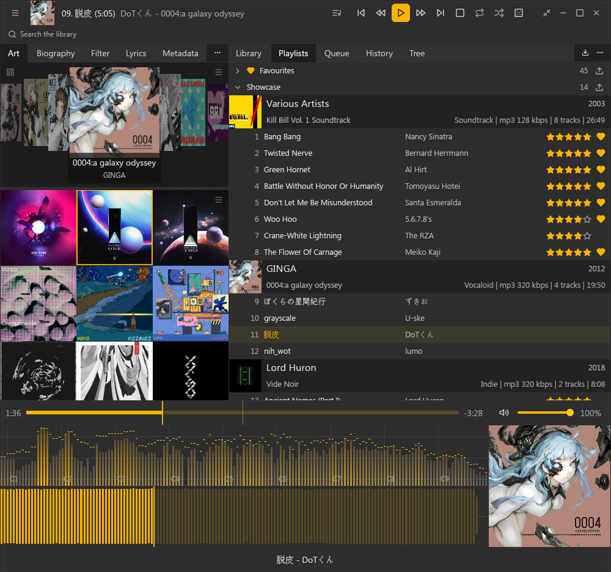
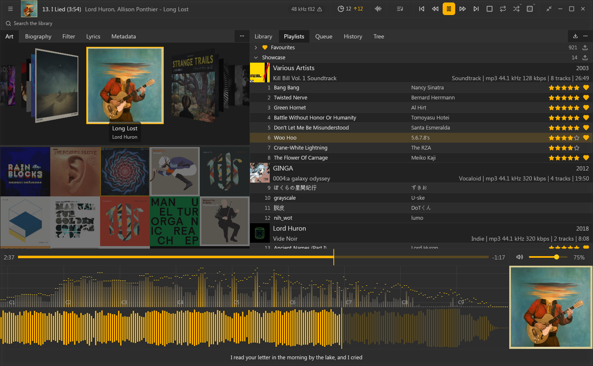
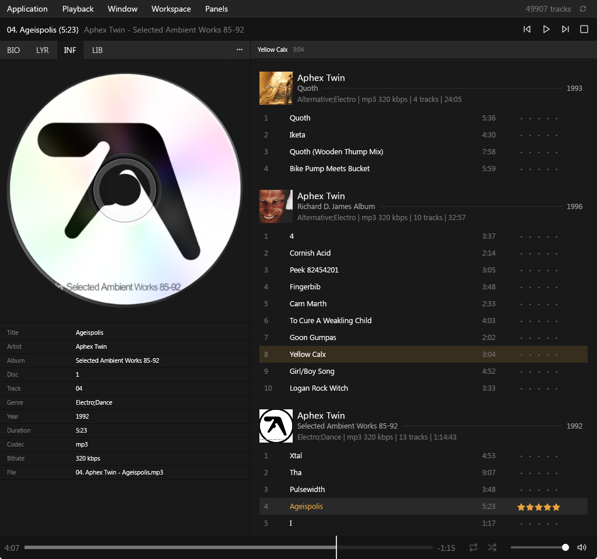
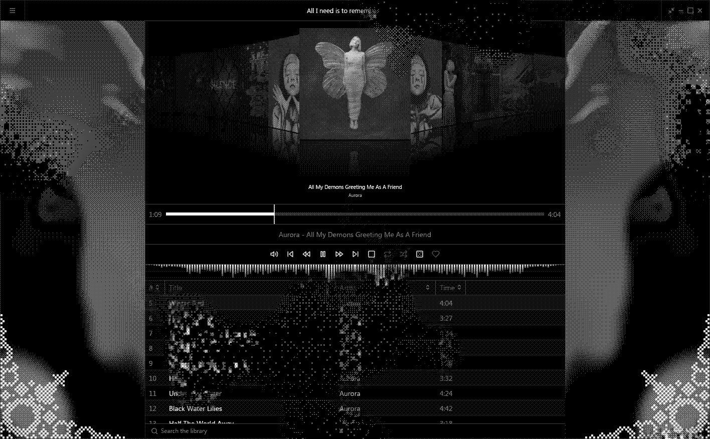
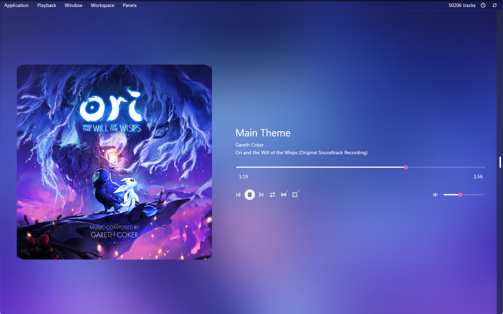
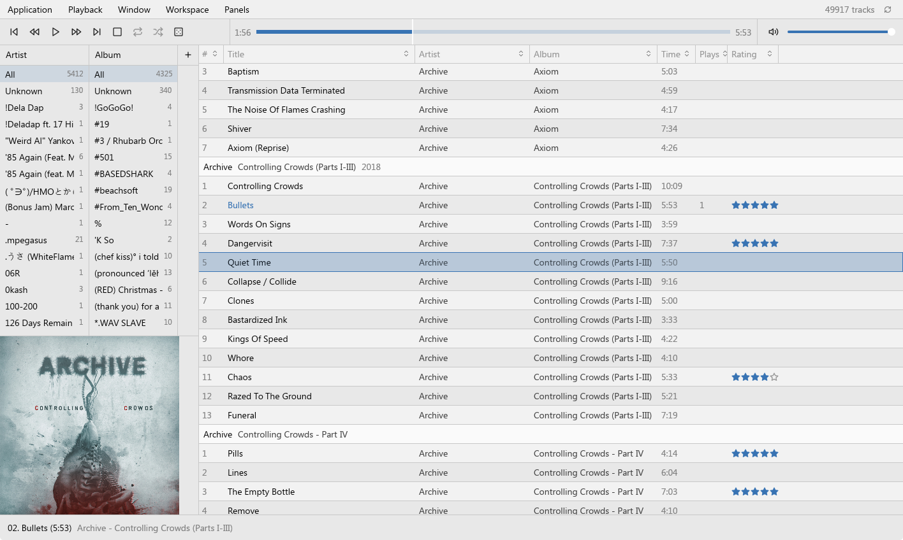
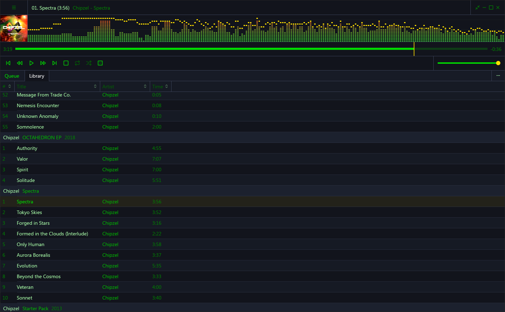
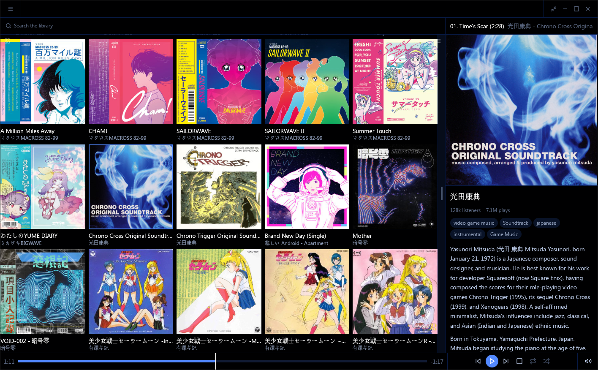
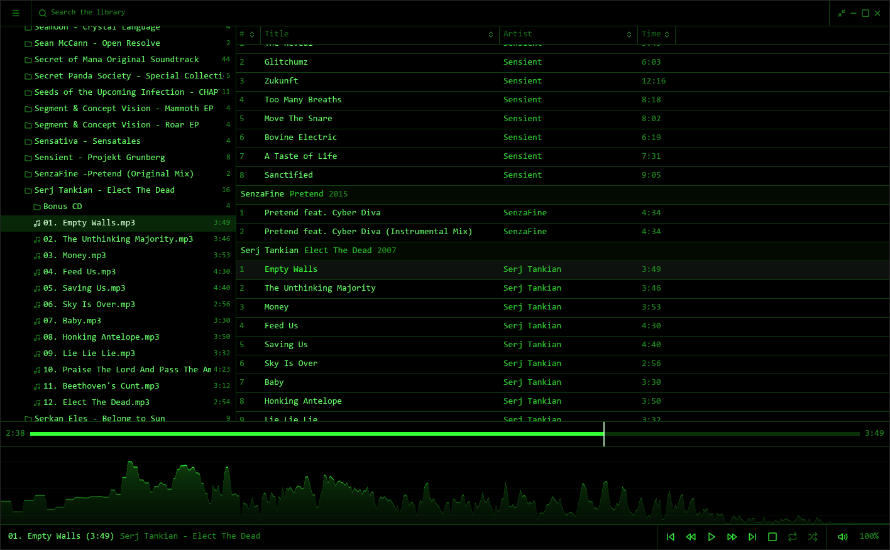

<p align="center">
  
</p>

<h1 align="center">rox</h1>

<p align="center"><em>If Foobar2000 was made in the current year.</em></p>

rox is a desktop music player for people with large, carefully tagged local libraries.
The UI is panels you compose yourself, duplicate with independent configs, and pop out
into real OS windows. Themes are token sets a person can share. Tagging is deep enough
to trust with a real collection, and the whole thing stays fast at tens of thousands of
tracks. Rust, built on gpui, with Linux, Mac, and Windows all first-class. If it doesn't
start in under a second, it isn't rox.



<details>
<summary><strong>The feature rundown</strong></summary>
<br>

| Area      | What's there                                                                                                                                                                                                        |
| --------- | ------------------------------------------------------------------------------------------------------------------------------------------------------------------------------------------------------------------- |
| Library   | Parallel scanner reading full tags, true durations, and each file's own codec, sample rate, and bit depth, live folder watching that handles renames, files with unreadable tags indexed by filename so nothing silently drops, folder tree, filters, and search, cue sheets whose tracks become real rows instead of one long file, a quick-play box over the whole workspace on one key, a duplicate finder that groups copies and trashes the ones you don't keep, and ffmpeg-backed conversion writing into a folder pattern you name |
| Playback  | Gapless single-stream engine, queue with shuffle, repeat, and play-next, endless play that refills the queue from your browse order, from what you've neglected, or from what the current track sounds like, crossfade that leaves album-contiguous boundaries alone, recovery when an audio device disappears, media keys and now-playing integration on all three platforms |
| Sound     | Optional local analysis describing how each track actually sounds, driving a sortable Similar column, Play Similar, and a nearest-by-sound shuffle. The built-in extractor needs no download; PANNs CNN10 or a weights file of your own if you want a heavier ear. Nothing leaves the machine |
| Audio     | A ten-band equalizer in a window of its own, ReplayGain off the tags with an EBU R128 pass for the files no tagger ever measured, and an exclusive output mode (ALSA, WASAPI, CoreAudio) that reports the format the hardware accepted |
| Panels    | Forty-odd panel types (library, queue, history, playlists, lyrics, cover, biography, artist and genre grids, spectrum, spectrogram, oscilloscope, waveform, VU, particles), composed freely, duplicated with independent configs, popped out into OS windows, saved as named presets, drawers that slide out over a panel and a mini layout you shrink into, and a design mode switch so a finished layout stays put |
| Theming   | Workspaces as single shareable files (layout, palette, appearance) in a folder you can drop a bundle into, palette tinting from the playing album's cover per window, light and dark following cover brightness |
| Shaders   | Music-reactive WGSL shaders in a panel or over the whole window: multi-pass pipelines, cover-art and image bindings, shipped examples or your own files, and a signals window for tuning what drives them. Shaders are included in workspace bundles and never run without your approval |
| Tagging   | Full tag editor with atomic writes and batch edits, multi-value genres with merges kept as a library opinion rather than a tag write, ratings stored in the files themselves (FMPS and POPM), online tag and cover lookup through MusicBrainz, iTunes, Deezer, and TheAudioDB, artist biographies, and a pass that embeds what rox stores (lyrics, gains, acoustic descriptions) into the files so another player reads it too |
| Lyrics    | Synced and plain lyrics from sidecar files, tags, or lrclib, with an in-panel editor that writes back where it read from                                                                                              |
| History   | A full listen log driving the history panel and stats window, Last.fm scrobbling with favourites and loved tracks synced in both directions                                                                          |
| Playlists | Favourites, drag reorder across playlists, m3u import and export, smart playlists that stay a query with their own sort and limit, entries that persist when their files leave and come back                            |
| Sharing   | Discord rich presence with optional Last.fm and YouTube buttons, and an Icecast source client that pushes what rox plays out as MP3, connecting outward only so an unreachable server never touches local playback |
| Language  | Nine translations besides the English source (German, French, Italian, Spanish, Brazilian Portuguese, Russian, Ukrainian, Japanese, Simplified Chinese), following the OS by default, with numbers, dates, and plurals rendered per locale |
| Control   | A JSON-RPC socket keyed to the data directory, with a `rox-mcp` proxy beside the app so an MCP client can ask what's playing, search the library, and work the transport. It stays off until you turn AI features on, and every tool call rechecks the toggle |
| System    | Tray with quit-to-tray, one instance per data directory, portable mode, a self-updater that checksum-verifies the release and stages it beside the running build (notify-only where the install folder isn't writable), a keymap where every shortcut rebinds, chords included, and a tasks window for the long library jobs with time estimates measured on your own machine |

</details>

## Benchmarks

All first-party numbers: the same machine (Ryzen 9 5950X, Linux/Wayland), the same
50k-track library on an external SSD, every player with the library loaded and
measured through one harness. Memory is PSS across the app's full process tree,
"loaded" is when CPU settles after launch, idle is a paused player with the window
visible.

| Player     | Window up | Fully loaded  | Memory  | Idle CPU |
| ---------- | --------- | ------------- | ------- | -------- |
| rox        | 0.3 s     | 2.3 s         | 180 MB  | 0.5%     |
| Elisa      | 0.7 s     | never settles | 206 MB  | 74%      |
| fooyin     | 0.3 s     | 18 s          | 364 MB  | 0%       |
| Quod Libet | -         | 19 s          | 384 MB  | 0.2%     |
| Strawberry | 0.3 s     | 32 s          | 434 MB  | 0.8%     |
| Museeks    | -         | 3 s           | 436 MB  | 0%       |
| Tauon      | 8.7 s     | 12 s          | 2.8 GB  | 0%       |

DeaDBeeF would come in at 44 MB, but it never got a row: its MP3 parser
segfaults partway through importing this library, every attempt. rox indexes all
50k tracks, including the truncated files that trip it.

rox pulls full tags and true durations from every file on import instead of
skimming headers, so the library you browse matches what's actually in the
files. The scanner is parallel and outruns storage: with file data cached, a
full import of this library takes about 3 seconds; from a cold external SSD it's
around 3 minutes, the drive maxed out with CPU to spare. Like for like, fooyin
re-imports the same collection from a reset in about 30 seconds where rox takes
3. In every rox run the ceiling was the disk, never the player.

rox ships as one binary: a 44 MB download that unpacks to 133 MB. Tauon's Flatpak is a
[135 MB download](https://flathub.org/apps/com.github.taiko2k.tauonmb), the
Spotify client idles between 300 and 900 MB. Foobar2000 itself stays lean, but
you knew that, that's the point.

## Why

I loved Foobar2000 because of panel UI you build yourself, a theme community on top of it
(CaTRoX, NekoRoX, Georgia), and tag and library management that held up at scale. That
stack is stranded on Windows, and nothing on Linux or Mac covers all three legs: Tauon's
tagging is shallow, Strawberry isn't composable, Quod Libet isn't something you'd theme.

Oh right, and it needs to be native, everywhere.

I've been working on and off on variations of rox over the years through Golang and its
fragmented GUI ecosystem. I landed on Wails but work on it was sporadic and I still had
my Foobar setup. Progress took ages because making a GUI app on Go maybe isn't the best
or maybe I'm just bad at it, but as I progressed, I also noticed that I was just doing
another webapp which killed a lot of my motivation to make a true spiritual successor
to Foobar2000 in my mind. It had to be fast, it had to be native, it had to look as
close as possible to CaTRoX.

Jump to the start of 2026 and I did a full-time move to Linux. Because of how CaTRoX
(and my NekoRoX fork) is built with tons of random workarounds, Internet Explorer
essentially running in panels and so on and so forth, it's just a pain to run through
Wine and it really surfaces just how hacky everything is put together. It feels like
the foundation isn't solid and everything is just one OS change away from exploding again.

I've been working on [Orbit](https://github.com/hivecom/orbit) on the side and wanted to
do an evaluation of [gpui](https://gpui.rs/) since I use [Zed](https://zed.dev/) and I
very much love the vision of going back native. I've been loving working with it for
prototypes and I realized I had most of the foundation written and all I had to do
is start mapping it over. So that's what I did. And now we have a new native player.

## Screenshots & Additional Workspaces

A workspace is a whole look in one shareable file: layout, palette, appearance.
These all ship in the box, one click away on the welcome window or in settings:

<table>
  <tr>
    <th width="50%">(Default / NekoRoX)</th>
    <th width="50%">CaTRoX</th>
  </tr>
  <tr>
    <td valign="top"></td>
    <td valign="top"></td>
  </tr>
  <tr>
    <th>Critters</th>
    <th>Diffuse</th>
  </tr>
  <tr>
    <td valign="top"></td>
    <td valign="top"></td>
  </tr>
  <tr>
    <th>Foobar</th>
    <th>Llama (WinAmp)</th>
  </tr>
  <tr>
    <td valign="top"></td>
    <td valign="top"></td>
  </tr>
  <tr>
    <th>Metro</th>
    <th>Phosphor</th>
  </tr>
  <tr>
    <td valign="top"></td>
    <td valign="top"></td>
  </tr>
</table>

## Download

Grab your platform's build from the [releases page](https://github.com/zealsprince/rox/releases/latest).

- **Linux**
  - **Arch Linux** - Available on the AUR as [`rox-player`](https://aur.archlinux.org/packages/rox-player).
  - **Tarball** - Unpack the tarball and run `./rox`.
- **macOS** - Open the DMG and drag `rox` into Applications.
- **Windows** - Run the setup, and rox lands in your Start menu. Prefer portable? Unzip
  the zip anywhere and run `rox.exe`. If SmartScreen objects, More info > Run anyway.

## Command line

- `rox <files or folders>` - play them now, replacing what's loaded. Folders expand to
  the audio files directly inside them.
- `--enqueue` / `-e` - append the given files to the up-next queue instead of playing.
- `--new-instance` - start a second rox against the same data directory. Without it a
  launch hands its files to the rox already running, which raises its window and takes
  them. Linux and macOS only; on Windows every launch starts its own instance.
- `--portable` - keep all data (library, settings, caches) in a `rox-data` folder beside
  the executable for this run. To stay portable across launches, drop an empty file named
  `portable` next to the executable, or flip the toggle in the Behavior settings.

## Development

With Nix:

```sh
nix develop
cargo run
```

The dev shell has the Rust toolchain and the Linux libraries gpui loads at runtime.
If you use direnv, `direnv allow` gets you the same shell on cd. The first build
compiles the whole gpui tree and takes a few minutes.

On a Mac you also need Xcode installed, nix or not: gpui compiles Metal shaders at
build time and nix can't ship Apple's Metal toolchain. On Xcode 26 that toolchain is
a separate one-time download: `xcodebuild -downloadComponent MetalToolchain`.

Without Nix you need stable Rust and gpui's system libraries from your distro (Wayland,
X11, Vulkan, xkbcommon, fontconfig, alsa); every Rust dependency comes from crates.io.
On Debian or Ubuntu that's:

```sh
sudo apt-get install -y pkg-config libasound2-dev libfontconfig1-dev \
  libwayland-dev libxkbcommon-x11-dev libx11-dev libxcb1-dev libvulkan-dev \
  libssl-dev
```

Run `./scripts/vendor-gpui.sh` once before building: it fetches gpui and gpui-component
and applies the small patches under `patches/` (the nix shell does this on entry).

Copy `.env.template` to `.env` to bake service identities into the binary at
compile time: `LASTFM_API_KEY` and `LASTFM_API_SECRET` for one-click scrobbler
connect, `DISCORD_APPLICATION_ID` for rich presence. Exported environment variables
win over the file. A build without any of them works the same minus those
integrations, and the Last.fm settings page takes your own key pair at runtime
either way.

Debug builds accept a `--fresh` flag that runs rox against a wiped scratch data
directory in the OS temp folder, so `cargo run -- --fresh` goes through the first-run
experience without touching your real settings or library. Release builds ignore it.

## Spec

Check out the [docs index](docs/README.md) which lists the altitude spec for how `rox` is built.
The vision, including what's out of scope, is in the [product docs](docs/01-product/01-vision.md).

## Bugs & Feature Requests

Something broke, or rox is missing the thing that would make it yours?
[Open an issue](https://github.com/zealsprince/rox/issues/new/choose). The forms only ask
for the essentials; repro steps, recordings, or a file that triggers the problem are all
welcome extras. If neither form fits, a blank issue is fine too.

## Chat

`#rox` is on `irc.hivecom.net`. Quick questions, workspace show-and-tell, or kicking an
idea around before it's an issue all fit there. No client handy? The [web chat](https://hivecom.net/chat?channel=rox)
works from the browser and opens straight into the channel.

Yes, IRC. You're looking at a Foobar2000 successor, what did you expect.

## AI

rox is written with AI tools because I'm building it for myself and I can only deliberately work on so
many projects at the same time. If you want to contribute high quality hand written code and take
over the development of rox instead of me using AI tools; be my guest.
